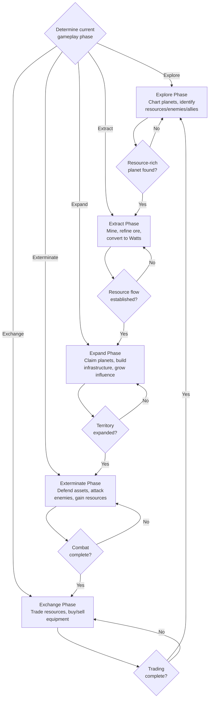

# 5X Framework Decision Tree

**Version**: 1.0.0
**Category**: gameplay
**Type**: decision-tree
**Description**: Decision tree for executing the 5X Framework gameplay loop (Explore, Extract, Expand, Exterminate, Exchange)

---

## Decision Flowchart

### Gameplay Loop

## Condition Table

| Condition | True Path | False Path | Notes |
|-----------|-----------|------------|-------|
| resourceRichPlanetFound == true | Transition to Extract | Continue Exploring | Explore phase completion |
| resourceFlowEstablished == true | Transition to Expand | Continue Extracting | Extract phase completion |
| territoryExpanded == true | Transition to Exterminate | Continue Expanding | Expand phase completion |
| combatComplete == true | Transition to Exchange | Continue Combat | Exterminate phase completion |
| tradingComplete == true | Transition to Explore (loop) | Continue Trading | Exchange phase completion |

## Phase Details

### Explore

**Purpose**: Discover the galaxy, find resources, locate enemies

| Action | Description |
|--------|-------------|
| Chart | Chart planets to reveal resources |
| Identify | Identify resources, enemies, and allies |
| Map | Map the surrounding galaxy |

**Transition**: Move to Extract when a resource-rich planet is found.

### Extract

**Purpose**: Mine Alpha Matter, convert to Watts, power operations

| Action | Description |
|--------|-------------|
| Mine | Mine Alpha Matter from planets |
| Refine | Refine ore to Alpha Matter (immediate priority) |
| Convert | Convert Alpha Matter to Watts |

**Transition**: Move to Expand when a stable resource flow is established.

### Expand

**Purpose**: Control planets, build infrastructure, grow influence

| Action | Description |
|--------|-------------|
| Claim | Claim planets |
| Build | Build infrastructure (defenses first) |
| Grow | Grow influence across territory |

**Transition**: Move to Exterminate when territory is sufficiently expanded.

### Exterminate

**Purpose**: Defend assets, attack enemies, gain resources from combat

| Action | Description |
|--------|-------------|
| Defend | Defend owned assets |
| Attack | Attack enemy positions |
| Gain | Gain resources from combat victories |

**Transition**: Move to Exchange when combat objectives are complete.

### Exchange

**Purpose**: Trade resources, buy/sell equipment, planet trading

| Action | Description |
|--------|-------------|
| Trade | Trade resources on the marketplace |
| Buy | Buy equipment and supplies |
| Sell | Sell excess resources |

**Transition**: Move to Explore to begin the loop again.

## Principles

- Execute phases in order: Explore, Extract, Expand, Exterminate, Exchange
- Complete phase actions before transitioning to the next phase
- The loop is continuous -- after Exchange, return to Explore
- Adapt the order based on situation, but maintain the core loop structure

## Related Documentation

- [Combat Decision Tree](decision-tree-combat.md) -- Detailed combat decisions (Exterminate phase)
- [Trading Decision Tree](decision-tree-trading.md) -- Detailed trading decisions (Exchange phase)
- [Resource Allocation Decision Tree](decision-tree-resource-allocation.md) -- Resource allocation (Extract/Exchange phases)
- [Build Requirements Decision Tree](decision-tree-build-requirements.md) -- Building requirements (Expand phase)
- [Resource Security Decision Tree](decision-tree-resource-security.md) -- Securing resources (Extract phase)
