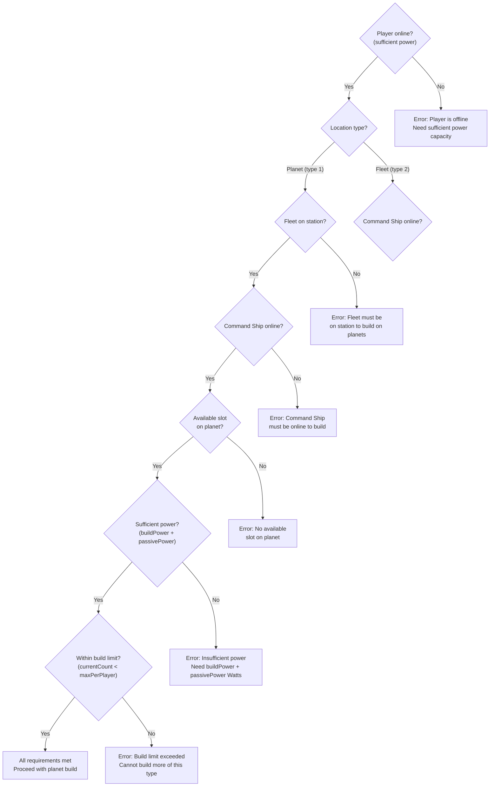
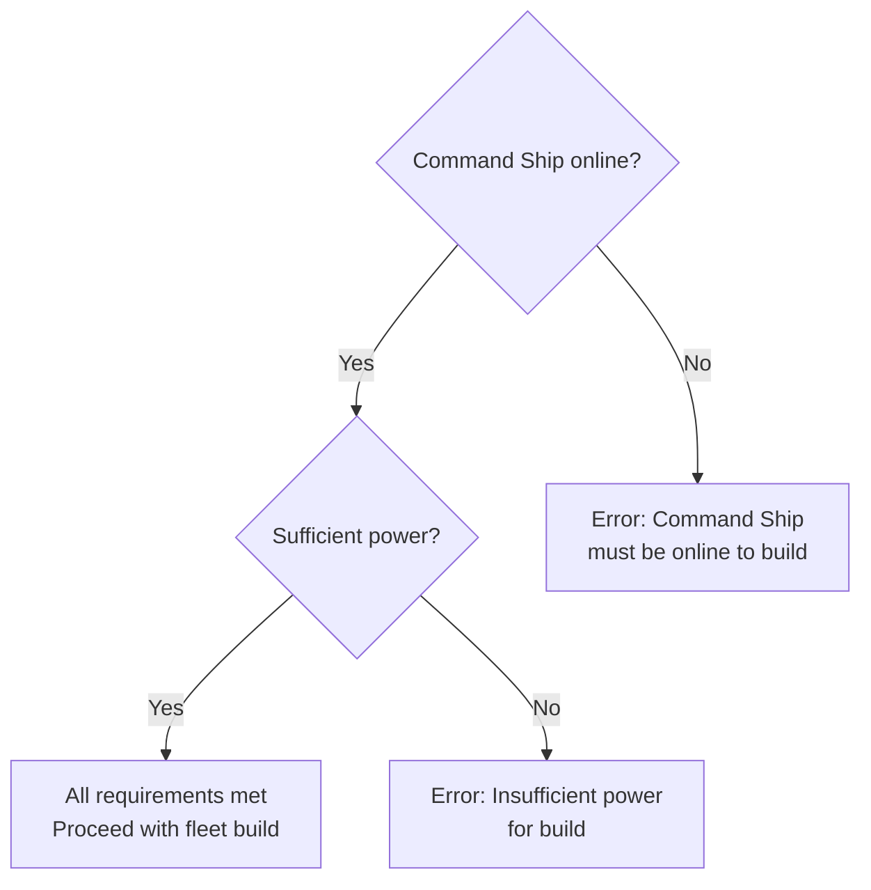

# Build Requirements Decision Tree

**Version**: 1.0.0
**Category**: gameplay
**Type**: decision-tree
**Description**: Decision tree for verifying all requirements before building structures

---

## Decision Flowchart

### Planet Building

### Fleet Building

## Condition Table

| Condition | True Path | False Path | Notes |
|-----------|-----------|------------|-------|
| playerOnline == true | Check location type | Error: player offline | First check, blocks all building |
| locationType == 1 (Planet) | Check fleet status | Check fleet location type | Planet building path |
| locationType == 2 (Fleet) | Check Command Ship | -- | Fleet building path |
| fleetOnStation == true | Check Command Ship | Error: fleet must be on station | Planet building only |
| commandShipOnline == true | Check next requirement | Error: CS must be online | Required for all building |
| availableSlot == true | Check power | Error: no available slot | Planet building only |
| sufficientPower >= requiredPower | Check build limit | Error: insufficient power | buildPower + passivePower |
| currentCount < maxPerPlayer | Proceed with build | Error: build limit exceeded | Per-struct-type limit |

## Requirements by Location

### Always Required

| Requirement | Description |
|-------------|-------------|
| playerOnline | Player must have sufficient power capacity to be online |
| commandShipOnline | Command Ship must be online to coordinate building |
| sufficientPower | Must have enough Watts for buildPower + passivePower |

### Planet Building (locationType = 1)

| Requirement | Description |
|-------------|-------------|
| fleetOnStation | Fleet must be at the planet (not away) |
| availableSlot | Planet must have an open building slot |

### Fleet Building (locationType = 2)

| Requirement | Description |
|-------------|-------------|
| fleetExists | Fleet must exist |

### Optional Checks

| Requirement | Description |
|-------------|-------------|
| buildLimit | Per-struct-type limit (e.g., Defense Cannon = 1 per player) |

## Check Order

Requirements should be verified in this specific order to fail fast with clear error messages:

1. **playerOnline** -- Is the player online with sufficient power?
2. **locationType** -- Where is the build happening (planet or fleet)?
3. **fleetOnStation** -- (Planet only) Is the fleet at the build location?
4. **commandShipOnline** -- Is the Command Ship online?
5. **availableSlot** -- (Planet only) Is there an open slot?
6. **sufficientPower** -- Is there enough power for buildPower + passivePower?
7. **buildLimit** -- Is the player within the per-type build limit?

## Common Failure Reasons

| Failure | Cause | Resolution |
|---------|-------|------------|
| Player offline | Insufficient power capacity | Convert Alpha Matter to Watts or reduce load |
| Fleet away | Fleet not at planet | Return fleet to station |
| Command Ship offline | Command Ship lacks power | Restore Command Ship power |
| No available slot | Planet full | Remove a struct or expand to another planet |
| Insufficient power | Not enough Watts | Produce more energy or reduce consumption |
| Build limit exceeded | Already at max for this struct type | Cannot build more of this type |

## Principles

- Verify all requirements before attempting to build
- Check requirements in order to fail fast with clear errors
- Provide actionable error messages for each failure case
- Different location types have different requirement sets

## Related Documentation

- [Power Management Decision Tree](decision-tree-power-management.md) -- Ensuring sufficient power for building
- [5X Framework Decision Tree](decision-tree-5x-framework.md) -- Building within the Expand phase
- [Resource Allocation Decision Tree](decision-tree-resource-allocation.md) -- Allocating energy for building operations
- [Action Quick Reference](../reference/action-quick-reference.md) -- Build action definitions
