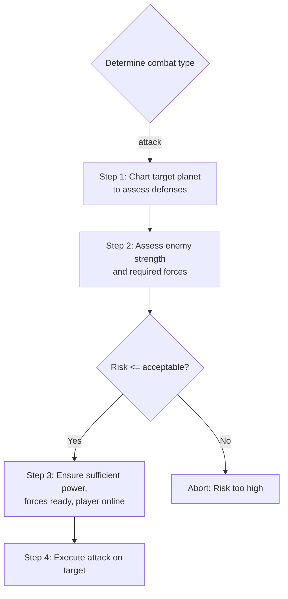
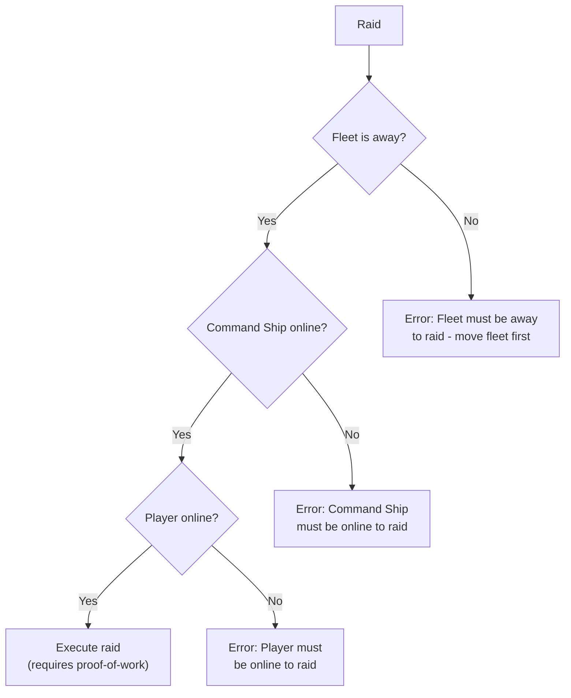
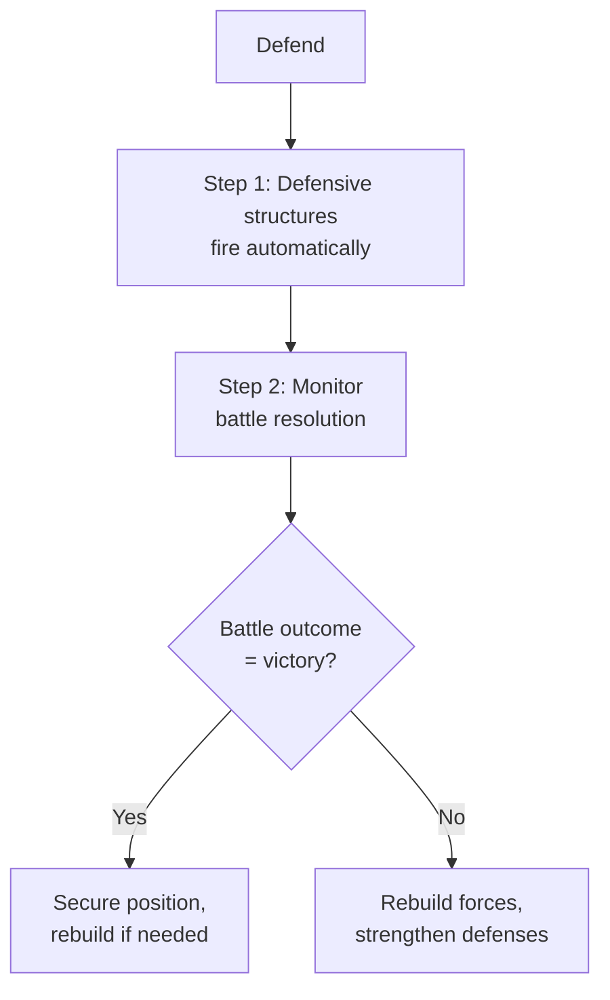

# Combat Decision Tree

**Version**: 1.0.0
**Category**: gameplay
**Type**: decision-tree
**Description**: Decision tree for scouting, assessing, preparing, and executing combat operations

---

## Decision Flowchart

### Attack Flow

### Raid Flow

### Defend Flow

## Condition Table

| Condition | True Path | False Path | Notes |
|-----------|-----------|------------|-------|
| combatType == attack | Scout, assess, prepare, execute | Check other combat types | First branch of combat type evaluation |
| risk <= acceptable | Prepare forces and execute | Abort attack | Assessed after scouting target |
| fleetAway == true | Check Command Ship status | Error: move fleet first | Required for raid initiation |
| commandShipOnline == true | Check player status | Error: CS must be online | Required for raid execution |
| playerOnline == true | Execute raid with PoW | Error: player must be online | Required for raid execution |
| battleOutcome == victory | Secure position | Rebuild and recover | Evaluated after defense resolution |

## Attack Workflow

The attack sequence follows a linear chain of scout, assess, prepare, and execute:

1. **Scout** -- Chart the target planet to assess its defenses. Gathering intelligence before committing forces prevents unnecessary losses.
2. **Assess** -- Evaluate enemy defenses, enemy forces, required forces, and overall risk. This step determines whether to proceed or abort.
3. **Prepare** -- If risk is acceptable, verify that the player has sufficient power, forces are ready, and the player is online.
4. **Execute** -- Carry out the attack on the target planet.

If risk is deemed too high during assessment, the attack is aborted to preserve resources.

## Raid Workflow

Raids have strict prerequisites that must all be satisfied in sequence:

1. **Fleet Away** -- The fleet must have departed its home station before a raid can begin.
2. **Command Ship Online** -- The Command Ship must be online to coordinate the raid.
3. **Player Online** -- The player must be online to authorize the raid action.
4. **Proof-of-Work** -- Raid execution requires a proof-of-work submission.

Failure at any step produces a specific error and halts the raid attempt.

## Defend Workflow

Defense operates differently from offensive actions:

1. **Automatic Fire** -- Defensive structures engage attackers automatically without player input.
2. **Monitor** -- The player monitors the battle as it resolves.
3. **Respond** -- After resolution, the player either secures their position (on victory) or rebuilds forces and strengthens defenses (on defeat).

## Requirements Summary

| Combat Type | Requirements |
|-------------|-------------|
| Attack | playerOnline, sufficientPower, structsOnline, validTarget |
| Raid | playerOnline, fleetAway, commandShipOnline, proofOfWork |
| Defend | defensiveStructuresActive |

## Principles

- Always scout before attacking
- Assess enemy strength and required forces
- Prepare sufficient power and forces
- Ensure online status before combat
- For raids: fleet must be away, Command Ship online, player online, proof-of-work required

## Related Documentation

- [Action Quick Reference](../reference/action-quick-reference.md) -- Combat action definitions
- [Gameplay Protocol](../protocols/gameplay-protocol.md) -- General gameplay patterns
- [Power Management Decision Tree](decision-tree-power-management.md) -- Ensuring sufficient power for combat
- [Build Requirements Decision Tree](decision-tree-build-requirements.md) -- Building defensive structures
