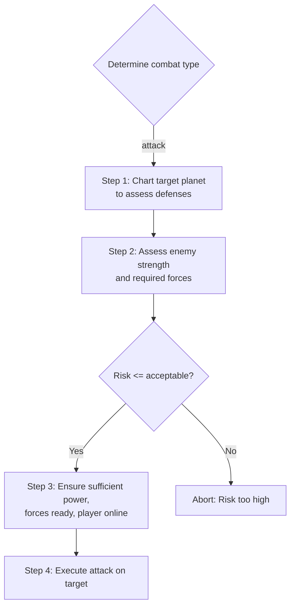
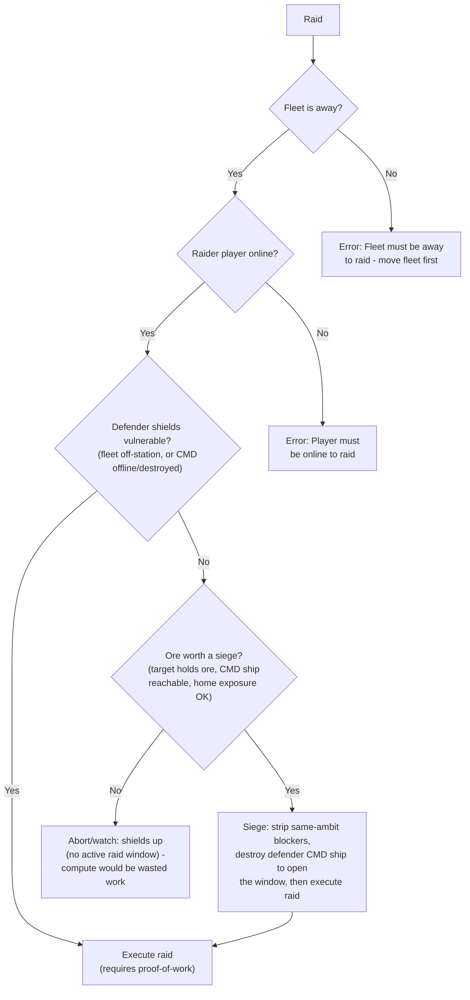
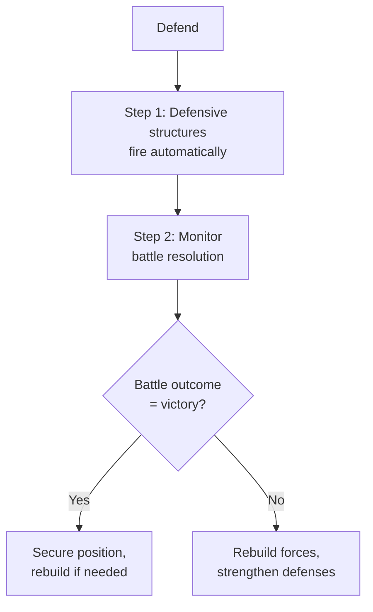
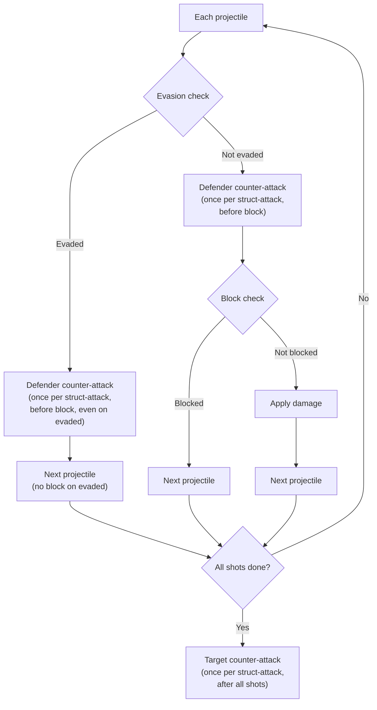

# Combat Decision Tree

**Version**: 1.0.0
**Category**: gameplay
**Type**: decision-tree
**Description**: Decision tree for scouting, assessing, preparing, and executing combat operations

---

## Decision Flowchart

### Attack Flow

```mermaid
flowchart TD
    combatType{"Determine combat type"}
    combatType -->|attack| scoutTarget["Step 1: Chart target planet\nto assess defenses"]
    scoutTarget --> assessRisk["Step 2: Assess enemy strength\nand required forces"]
    assessRisk --> riskCheck{"Risk <= acceptable?"}
    riskCheck -->|Yes| prepare["Step 3: Ensure sufficient power,\nforces ready, player online"]
    prepare --> executeAttack["Step 4: Execute attack on target"]
    riskCheck -->|No| abortAttack["Abort: Risk too high"]
```

### Raid Flow

```mermaid
flowchart TD
    raidStart["Raid"] --> fleetCheck{"Fleet is away?"}
    fleetCheck -->|Yes| playerCheck{"Raider player online?"}
    fleetCheck -->|No| errFleet["Error: Fleet must be away\nto raid - move fleet first"]
    playerCheck -->|Yes| shieldCheck{"Defender shields vulnerable?\n(fleet off-station, or CMD\noffline/destroyed)"}
    playerCheck -->|No| errPlayer["Error: Player must\nbe online to raid"]
    shieldCheck -->|Yes| executeRaid["Execute raid\n(requires proof-of-work)"]
    shieldCheck -->|No| createVuln{"Ore worth a siege?\n(target holds ore, CMD ship\nreachable, home exposure OK)"}
    createVuln -->|Yes| siege["Siege: strip same-ambit blockers,\ndestroy defender CMD ship to open\nthe window, then execute raid"]
    createVuln -->|No| errShield["Abort/watch: shields up\n(no active raid window) -\ncompute would be wasted work"]
    siege --> executeRaid
```

Vulnerability is a state you can create: if the defender is shielded (Command Ship online, fleet on station), you either wait for them to slip (opportunistic) or **destroy their Command Ship** to force the window open (siege). "Shields up" is a decision point, not a dead end.

### Defend Flow

```mermaid
flowchart TD
    defendStart["Defend"] --> autoFire["Step 1: Defensive structures\nfire automatically"]
    autoFire --> monitor["Step 2: Monitor\nbattle resolution"]
    monitor --> outcome{"Battle outcome\n= victory?"}
    outcome -->|Yes| secure["Secure position,\nrebuild if needed"]
    outcome -->|No| recover["Rebuild forces,\nstrengthen defenses"]
```

### Combat Resolution Order (Per struct-attack)

```mermaid
flowchart TD
    shot["Each projectile"] --> evasion{"Evasion check"}
    evasion -->|Evaded| defCounter["Defender counter-attack\n(once per struct-attack,\nbefore block, even on evaded)"]
    evasion -->|Not evaded| defCounter2["Defender counter-attack\n(once per struct-attack,\nbefore block)"]
    defCounter --> nextShot["Next projectile\n(no block on evaded)"]
    defCounter2 --> block{"Block check"}
    block -->|Blocked| nextShot2["Next projectile"]
    block -->|Not blocked| damage["Apply damage"]
    damage --> nextShot3["Next projectile"]
    nextShot --> allDone{"All shots done?"}
    nextShot2 --> allDone
    nextShot3 --> allDone
    allDone -->|No| shot
    allDone -->|Yes| targetCounter["Target counter-attack\n(once per struct-attack,\nafter all shots)"]
```

## Condition Table

| Condition | True Path | False Path | Notes |
|-----------|-----------|------------|-------|
| combatType == attack | Scout, assess, prepare, execute | Check other combat types | First branch of combat type evaluation |
| risk <= acceptable | Prepare forces and execute | Abort attack | Assessed after scouting target |
| fleetAway == true | Check raider player status | Error: move fleet first | Required for raid initiation |
| playerOnline == true | Check defender shields | Error: player must be online | Raider's player must be online |
| defenderShieldsVulnerable == true | Execute raid with PoW | Siege decision (create vulnerability) or abort | Vulnerable = defender's fleet off-station, or CMD offline/destroyed. If not vulnerable, evaluate destroying the CMD ship to force the window rather than treating it as a hard stop. |
| battleOutcome == victory | Secure position | Rebuild and recover | Evaluated after defense resolution |

## Attack Workflow

The attack sequence follows a linear chain of scout, assess, prepare, and execute:

1. **Scout** -- Chart the target planet to assess its defenses. Gathering intelligence before committing forces prevents unnecessary losses.
2. **Assess** -- Evaluate enemy defenses, enemy forces, required forces, and overall risk. This step determines whether to proceed or abort.
3. **Prepare** -- If risk is acceptable, verify that the player has sufficient power, forces are ready, and the player is online.
4. **Execute** -- Carry out the attack on the target planet.

If risk is deemed too high during assessment, the attack is aborted to preserve resources.

## Raid Workflow

Raids have strict prerequisites that must all be satisfied in sequence:

1. **Fleet Away** -- The fleet must have departed its home station before a raid can begin.
2. **Player Online** -- The raider's player must be online to authorize the raid action.
3. **Defender Shields Vulnerable** -- The target's shields must be vulnerable (defender's fleet off-station, or their Command Ship offline/destroyed/non-existent); otherwise completion is rejected with `shields_active` (and `planet-raid-compute` refuses with "no active raid window" while `blockStartRaid == 0`). If the defender is shielded, you can **create** vulnerability: with your fleet present at the target, strip same-ambit blockers and destroy the defender's Command Ship to open the window (the **siege** path). Note an idle/dormant owner is not automatically vulnerable — a powered Command Ship keeps defending.
4. **Proof-of-Work** -- Raid execution requires a proof-of-work submission.

Failure at any step produces a specific error and halts the raid attempt (or, for a shielded defender, points you at the siege path rather than a dead end).

## Defend Workflow

Defense operates differently from offensive actions:

1. **Automatic Fire** -- Defensive structures engage attackers automatically without player input.
2. **Monitor** -- The player monitors the battle as it resolves.
3. **Respond** -- After resolution, the player either secures their position (on victory) or rebuilds forces and strengthens defenses (on defeat).

**Combat Resolution Order** (per struct-attack invocation):
1. Each projectile undergoes an **evasion** check.
2. **Defender counter-attack** fires once (before block, even on evaded shots).
3. **Block** check occurs only if the shot was not evaded.
4. **Damage** is applied per-projectile.
5. After all shots resolve, **target counter-attack** fires once.

## Requirements Summary

| Combat Type | Requirements |
|-------------|-------------|
| Attack | structOnline, ownerOnline, sufficientCharge, targetBuilt (validTarget) |
| Raid | playerOnline, fleetAway, defenderShieldsVulnerable, proofOfWork |
| Defend | defensiveStructuresActive |

## Principles

- Always scout before attacking
- Assess enemy strength and required forces
- Prepare sufficient power and forces
- Ensure online status before combat
- An attack only requires the attacking struct and its owner online (not the attacker's Command Ship); the target must be a built struct
- For raids: fleet must be away, raider's player online, defender's shields vulnerable, proof-of-work required

## Related Documentation

- [Action Quick Reference](../reference/action-quick-reference.md) -- Combat action definitions
- [Gameplay Protocol](../protocols/gameplay-protocol.md) -- General gameplay patterns
- [Power Management Decision Tree](decision-tree-power-management.md) -- Ensuring sufficient power for combat
- [Build Requirements Decision Tree](decision-tree-build-requirements.md) -- Building defensive structures
