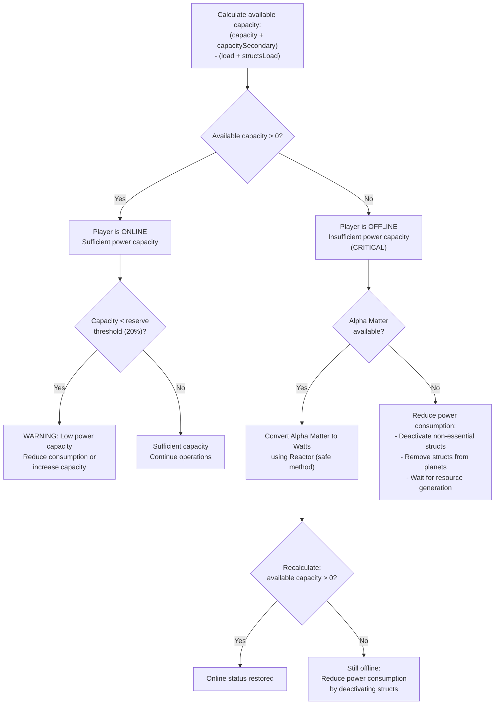

# Power Management Decision Tree

**Version**: 1.0.0
**Category**: gameplay
**Type**: decision-tree
**Description**: Decision tree for managing power capacity and maintaining online status

---

## Decision Flowchart

## Condition Table

| Condition | True Path | False Path | Notes |
|-----------|-----------|------------|-------|
| availableCapacity > 0 | Player online | Player offline (critical) | Primary status check |
| availableCapacity < reserveThreshold | Low capacity warning | Continue normal operations | 20% of total capacity threshold |
| alphaMatter > 0 | Convert to Watts via Reactor | Must reduce power consumption | Recovery path when offline |
| Recalculated capacity > 0 | Online status restored | Reduce consumption further | After conversion attempt |

## Formulas

| Formula | Expression | Purpose |
|---------|------------|---------|
| Available Capacity | (capacity + capacitySecondary) - (load + structsLoad) | Determine remaining power |
| Player Online | (load + structsLoad) <= (capacity + capacitySecondary) | Online status condition |
| Reserve Threshold | (capacity + capacitySecondary) x 0.2 | 20% reserve warning level |

## Online vs Offline Status

| Status | Condition | Can Act | Description |
|--------|-----------|---------|-------------|
| Online | (load + structsLoad) <= (capacity + capacitySecondary) | Yes | Player can perform all actions |
| Offline | (load + structsLoad) > (capacity + capacitySecondary) | No | Player cannot perform actions |

## Recovery Procedure

When a player goes offline due to insufficient power capacity:

1. **Check Alpha Matter** -- If Alpha Matter is available, convert it to Watts using a Reactor (the safe conversion method).
2. **Recalculate capacity** -- After conversion, recalculate available capacity to determine if online status has been restored.
3. **Reduce consumption** -- If still offline after conversion (or if no Alpha Matter is available), reduce power consumption by deactivating non-essential structs, removing structs from planets, or waiting for resource generation.

## Principles

- Maintain online status at all times: total load must not exceed total capacity
- Keep a 20% reserve capacity as a buffer against unexpected load increases
- Convert Alpha Matter to Watts proactively before reaching critical levels
- Reduce consumption as a last resort when conversion is insufficient or unavailable

## Related Documentation

- [Reactor vs Generator Decision Tree](decision-tree-reactor-vs-generator.md) -- Choosing energy production methods
- [Build Requirements Decision Tree](decision-tree-build-requirements.md) -- Power requirements for building
- [Resource Allocation Decision Tree](decision-tree-resource-allocation.md) -- Allocating energy across operations
- [Resource Security Decision Tree](decision-tree-resource-security.md) -- Securing Alpha Matter for conversion
