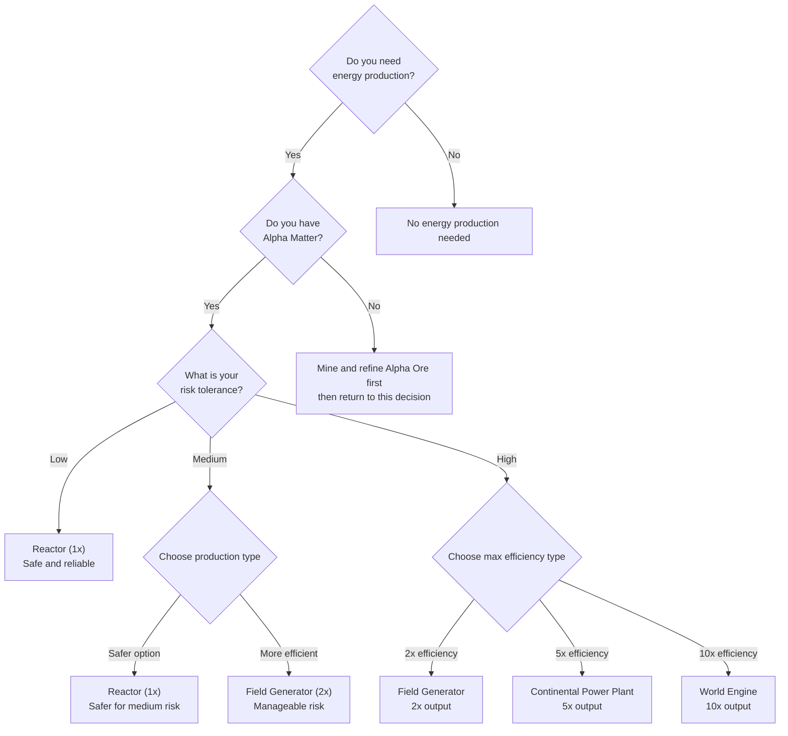

# Reactor vs Generator Decision Tree

**Version**: 1.0.0
**Category**: economic
**Priority**: high
**Description**: Decision tree for choosing between Reactor (safe) and Generator (efficient) for energy production

---

## Decision Flowchart

## Condition Table

| Condition | True Path | False Path | Notes |
|-----------|-----------|------------|-------|
| Need energy production? | Check Alpha Matter | No action needed | Entry point |
| Have Alpha Matter? | Assess risk tolerance | Mine and refine first | Prerequisite for all production |
| Risk tolerance = low | Reactor (1x) | -- | Safest option |
| Risk tolerance = medium | Field Generator (2x) or Reactor | -- | Balanced choice |
| Risk tolerance = high | Field Generator, Continental Power Plant, or World Engine | -- | Maximum efficiency options |

## Production Type Comparison

| Type | Rate | Formula | Risk | Efficiency | Best For |
|------|------|---------|------|------------|----------|
| Reactor | 1x | Energy (kW) = Alpha Matter (g) x 1 | Low | 100% | Beginners, reliability, network stability |
| Field Generator | 2x | Energy (kW) = Alpha Matter (g) x 2 | High | 200% | Experienced players, acceptable risk |
| Continental Power Plant | 5x | Energy (kW) = Alpha Matter (g) x 5 | High | 500% | High-risk strategies, maximum efficiency |
| World Engine | 10x | Energy (kW) = Alpha Matter (g) x 10 | High | 1000% | Maximum risk/reward, extreme efficiency |

## Production Examples

Using 100 grams of Alpha Matter as input:

| Type | Input | Output | Risk |
|------|-------|--------|------|
| Reactor | 100g Alpha Matter | 100 kW | Low |
| Field Generator | 100g Alpha Matter | 200 kW | High |
| Continental Power Plant | 100g Alpha Matter | 500 kW | High |
| World Engine | 100g Alpha Matter | 1000 kW | High |

## Reactor

The Reactor is the safe, reliable choice for energy production. It converts Alpha Matter to Energy at a 1:1 ratio with low risk.

**Pros**: Safe, reliable, predictable, lower risk

**Cons**: Lower efficiency, 1x output only

**Design intent**: Network stability. Reactors are intentionally lower-efficiency to provide a reliable baseline for the game economy.

## Generators

Generators offer higher efficiency at the cost of increased risk. Three tiers are available:

**Field Generator (2x)** -- Doubles output compared to Reactor. Suitable for players comfortable with moderate risk who want better returns.

**Continental Power Plant (5x)** -- Five times Reactor output. Designed for experienced players pursuing aggressive strategies.

**World Engine (10x)** -- Ten times Reactor output. The highest risk/reward option, suited for players willing to accept extreme risk for maximum efficiency.

**Design intent**: Higher returns with inflation control. Generators create a risk/reward tradeoff that drives economic decisions.

## Energy Properties

- **Ephemeral** -- Energy must be consumed immediately upon production. It cannot be stored.
- **Shared** -- Energy is shared across all Structs connected to the same power source.

## Best Practices

- **Choose Reactor for safety** -- When reliability matters more than efficiency, Reactors are the correct choice.
- **Choose Generators for efficiency** -- When you can tolerate risk and need higher output, Generators provide 2x to 10x returns.
- **Plan consumption before production** -- Since energy is ephemeral, always know what you will use it for before producing it.

## Related Documentation

- [Resource Allocation Decision Tree](decision-tree-resource-allocation.md) -- Allocating Alpha Matter across uses
- [Power Management Decision Tree](decision-tree-power-management.md) -- Managing power capacity and online status
- [Trading Decision Tree](decision-tree-trading.md) -- Trading energy on the marketplace
- [Resource Security Decision Tree](decision-tree-resource-security.md) -- Securing Alpha Matter through refinement
