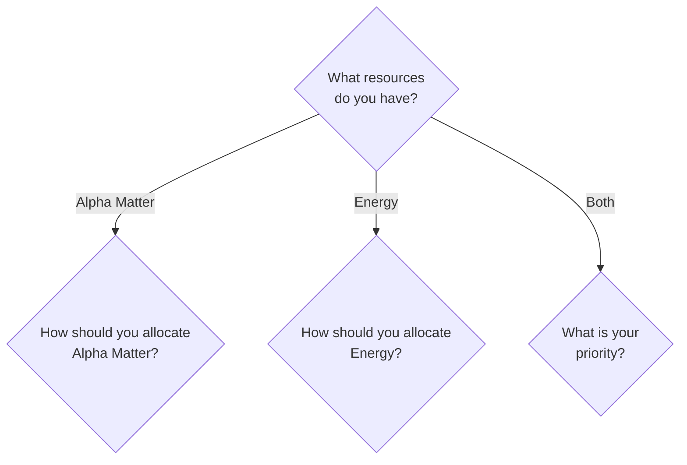
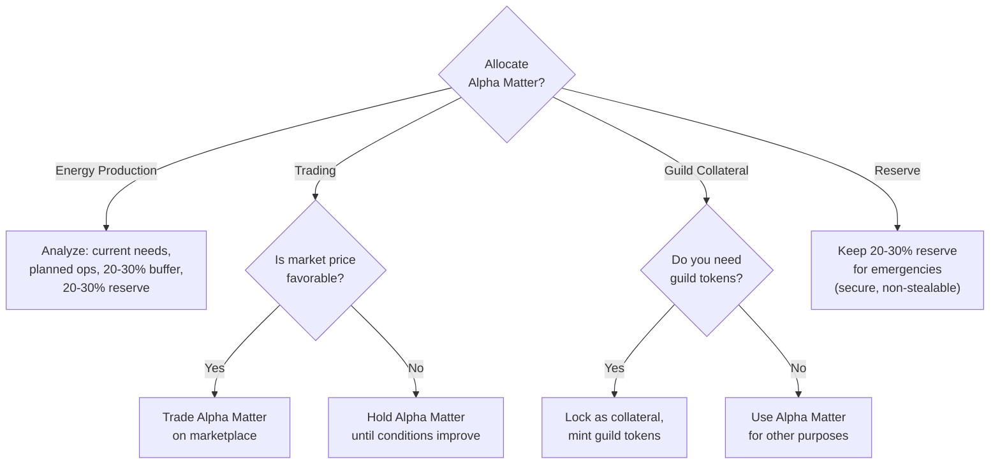
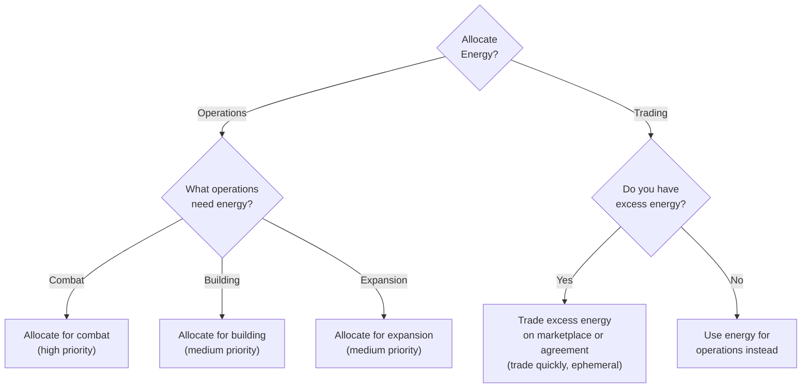
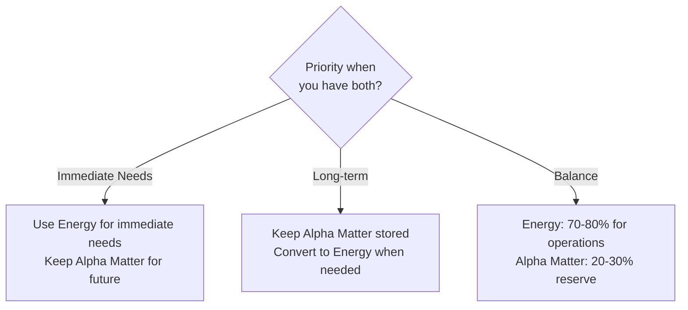

# Resource Allocation Decision Tree

**Version**: 1.0.0
**Category**: economic
**Priority**: high
**Description**: Decision tree for allocating resources (Alpha Matter, Energy) across different operations

---

## Decision Flowchart

### Resource Selection

### Alpha Matter Allocation

### Energy Allocation

### Both Resources

## Condition Table

| Condition | True Path | False Path | Notes |
|-----------|-----------|------------|-------|
| Resource = Alpha Matter | Alpha Matter allocation options | Check other resources | Primary resource branch |
| Resource = Energy | Energy allocation options | Check other resources | Ephemeral resource branch |
| Market price favorable? | Trade Alpha Matter | Hold until conditions improve | For trading allocation |
| Need guild tokens? | Lock as collateral, mint tokens | Use for other purposes | For guild collateral allocation |
| Have excess energy? | Trade on marketplace/agreement | Use for operations | Prerequisite for energy trading |

## Alpha Matter Allocation

Alpha Matter is the storable, secure resource. It cannot be stolen and can be held indefinitely. Allocation decisions center on balancing immediate use against reserve maintenance.

**Energy Production** -- Analyze current energy needs, planned operations, and maintain a 20-30% energy buffer. Always keep a 20-30% Alpha Matter reserve before allocating the remainder to energy production.

**Trading** -- Only allocate Alpha Matter for trading when market conditions are favorable. When prices are unfavorable, hold and wait for better conditions.

**Guild Token Collateral** -- When guild operations require tokens, lock Alpha Matter as collateral and mint through the guild central bank. Skip this allocation when guild tokens are not needed.

**Reserve** -- Maintain 20-30% of total Alpha Matter as a reserve for emergencies. Alpha Matter is secure and non-stealable, making it a reliable reserve.

## Energy Allocation

Energy is ephemeral and must be consumed immediately upon production. This constraint drives all energy allocation toward immediate use.

**Operations** are prioritized by urgency:

| Operation | Priority | Description |
|-----------|----------|-------------|
| Combat | High | Energy for attacks and defense |
| Building | Medium | Energy for struct construction |
| Expansion | Medium | Energy for planet exploration and growth |

**Trading** -- Only trade energy when you have excess beyond operational needs. Energy is ephemeral, so sell quickly via the marketplace or set up an automated agreement.

## Combined Resource Strategy

When holding both Alpha Matter and Energy:

| Strategy | Energy Use | Alpha Matter Use | Best For |
|----------|-----------|-------------------|----------|
| Immediate Needs | Use now for operations | Save for future | Active operations requiring energy |
| Long-term Planning | Convert from Alpha Matter as needed | Store indefinitely | Strategic reserve building |
| Balance | 70-80% for operations | 20-30% reserve | Steady-state operations |

## Allocation Principles

- **Energy is ephemeral** -- Allocate to operations immediately; it cannot be stored.
- **Alpha Matter is secure** -- Safe to store and allocate as needed without theft risk.
- **Maintain reserves** -- Keep 20-30% Alpha Matter reserve for emergencies.
- **Prioritize critical operations** -- Allocate to high-priority operations (combat) before medium-priority ones (building, expansion).

## Related Documentation

- [Trading Decision Tree](decision-tree-trading.md) -- Trading Alpha Matter and Energy
- [Reactor vs Generator Decision Tree](decision-tree-reactor-vs-generator.md) -- Energy production from Alpha Matter
- [Power Management Decision Tree](decision-tree-power-management.md) -- Managing power capacity
- [Resource Security Decision Tree](decision-tree-resource-security.md) -- Securing resources through refinement
