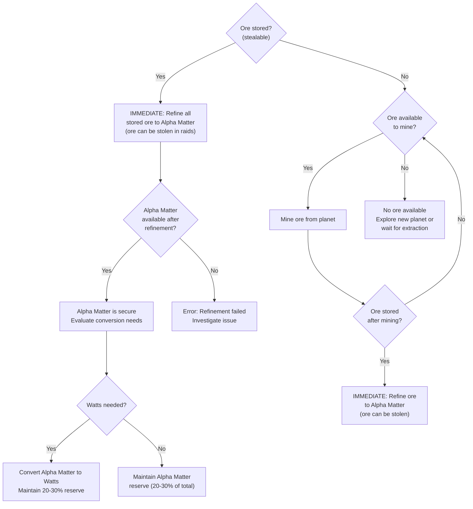

# Resource Security Decision Tree

**Version**: 1.0.0
**Category**: gameplay
**Type**: decision-tree
**Description**: Decision tree for securing resources by refining ore immediately

---

## Decision Flowchart

## Condition Table

| Condition | True Path | False Path | Notes |
|-----------|-----------|------------|-------|
| oreStored > 0 | Refine immediately | Check if ore available to mine | Ore is stealable, high priority |
| alphaMatter > 0 (after refine) | Evaluate conversion needs | Error: refinement failed | Verify refinement succeeded |
| wattsNeeded > 0 | Convert to Watts (keep 20-30% reserve) | Store as Alpha Matter reserve | Post-refinement decision |
| currentOre > 0 | Mine ore from planet | Explore or wait | When no stored ore exists |
| oreStored > 0 (after mining) | Refine immediately | Continue mining | Always refine after mining |

## Resource Security Status

| Resource | Status | Risk | Required Action |
|----------|--------|------|-----------------|
| Ore | Stealable | High | Refine immediately |
| Alpha Matter | Secure | None | Maintain 20-30% reserve |

## Security Workflow

The core security principle is simple: **never leave ore unrefined**. Ore can be stolen during raids, but Alpha Matter cannot.

1. **Check for stored ore** -- If any ore is stored on a planet, it is vulnerable to theft during raids.
2. **Refine immediately** -- Convert all stored ore to Alpha Matter as the highest priority action. This eliminates the theft risk entirely.
3. **Verify refinement** -- Confirm that Alpha Matter is available after the refinement process. If not, investigate the failure.
4. **Evaluate Watts needs** -- Once Alpha Matter is secured, decide whether to convert some to Watts (energy) based on operational needs. Always maintain a 20-30% Alpha Matter reserve.
5. **Mining cycle** -- When no ore is stored, mine from the planet and immediately refine the result. If no ore is available to mine, explore new planets or wait for extraction cycles.

## Principles

- Always refine ore to Alpha Matter immediately after mining
- Never leave ore unrefined on a planet -- it is vulnerable to raids
- Maintain a 20-30% Alpha Matter reserve at all times
- Ore can be stolen; Alpha Matter cannot

## Related Documentation

- [Resource Allocation Decision Tree](decision-tree-resource-allocation.md) -- Allocating secured resources
- [Combat Decision Tree](decision-tree-combat.md) -- Raid mechanics that threaten ore
- [Reactor vs Generator Decision Tree](decision-tree-reactor-vs-generator.md) -- Converting Alpha Matter to energy
- [5X Framework Decision Tree](decision-tree-5x-framework.md) -- Extract phase resource handling
