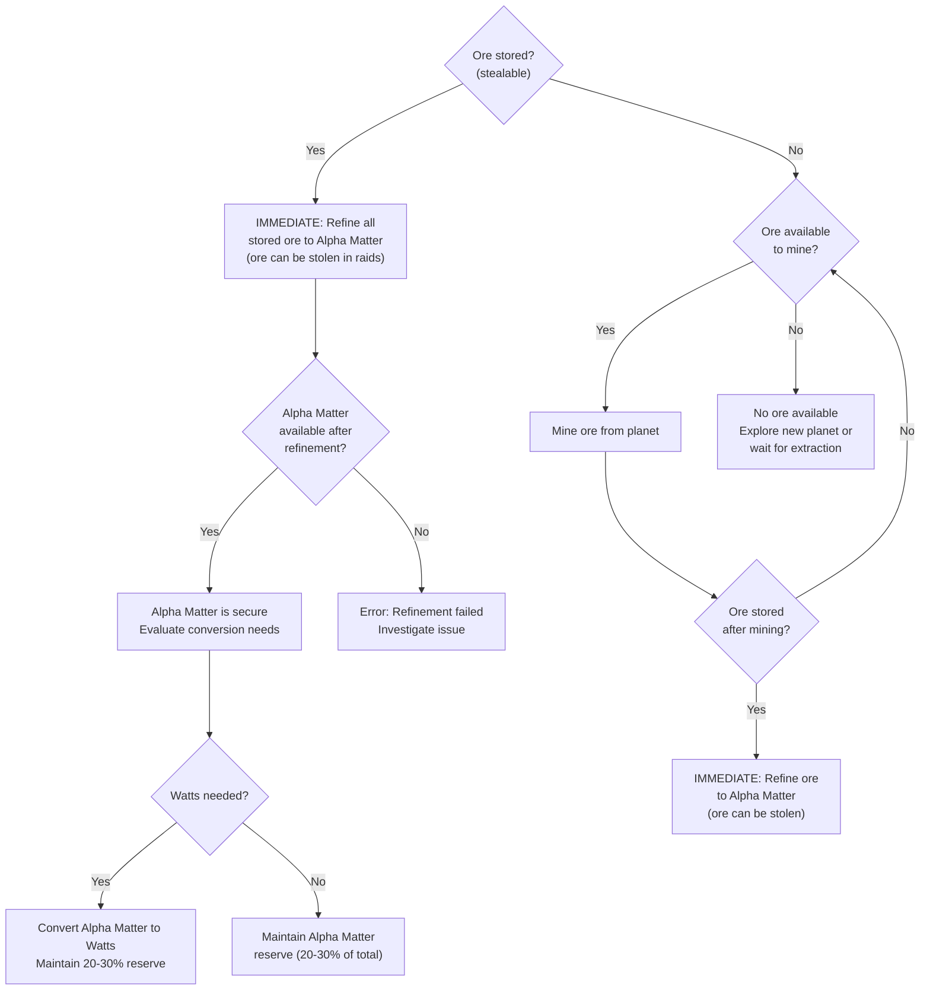

# Resource Security Decision Tree

**Version**: 1.0.0
**Category**: gameplay
**Type**: decision-tree
**Description**: Decision tree for securing resources by refining ore immediately

---

## Decision Flowchart

```mermaid
flowchart TD
    oreCheck{"Ore stored?\n(stealable)"}
    oreCheck -->|Yes| refineNow["IMMEDIATE: Refine all\nstored ore to Alpha Matter\n(ore can be stolen in raids)"]
    oreCheck -->|No| mineCheck{"Ore available\nto mine?"}

    refineNow --> alphaCheck{"Alpha Matter\navailable after\nrefinement?"}
    alphaCheck -->|Yes| evalNeeds["Alpha Matter is secure\nEvaluate conversion needs"]
    alphaCheck -->|No| refineError["Error: Refinement failed\nInvestigate issue"]

    evalNeeds --> wattsCheck{"Watts needed?"}
    wattsCheck -->|Yes| convertWatts["Convert Alpha Matter to Watts\nMaintain 20-30% reserve"]
    wattsCheck -->|No| storeAlpha["Maintain Alpha Matter\nreserve (20-30% of total)"]

    mineCheck -->|Yes| mineOre["Mine ore from planet"]
    mineCheck -->|No| exploreNew["No ore available\nExplore new planet or\nwait for extraction"]

    mineOre --> postMineCheck{"Ore stored\nafter mining?"}
    postMineCheck -->|Yes| refinePost["IMMEDIATE: Refine ore\nto Alpha Matter\n(ore can be stolen)"]
    postMineCheck -->|No| mineCheck
```

## Condition Table

| Condition | True Path | False Path | Notes |
|-----------|-----------|------------|-------|
| oreStored > 0 | Refine immediately | Check if ore available to mine | Ore is stealable, high priority |
| alphaMatter > 0 (after refine) | Evaluate conversion needs | Error: refinement failed | Verify refinement succeeded |
| wattsNeeded > 0 | Convert to Watts (keep 20-30% reserve) | Store as Alpha Matter reserve | Post-refinement decision |
| currentOre > 0 | Mine ore from planet | Explore or wait | When no stored ore exists |
| oreStored > 0 (after mining) | Refine immediately | Continue mining | Always refine after mining |

## Resource Security Status

| Resource | Status | Risk | Required Action |
|----------|--------|------|-----------------|
| Ore | Stealable | High | Refine immediately |
| Alpha Matter | Secure | None | Maintain 20-30% reserve |

## Security Workflow

The core security principle is simple: **never leave player `storedOre` / `gridAttributes.ore` unrefined**. Ore can be stolen during raids, but Alpha Matter cannot. Ore Bunkers raise planetary shield; they do **not** hold ore.

1. **Check for stored ore** -- Query the **player** (`gridAttributes.ore`). Planet `remainingOre` is unmined and not raidable.
2. **Refine immediately** -- Launch `struct-ore-refine-compute` as soon as ore lands (not mid-raid unless already completable).
3. **Verify refinement** -- Confirm Alpha Matter increased / ore went to zero after completion.
4. **Evaluate Watts needs** -- Once Alpha Matter is secured, decide whether to infuse reactors/generators. Always maintain a reserve.
5. **Mining cycle** -- When no ore is stored, mine from the planet and refine the result. When the planet is empty, follow planet-depletion (one-planet explore).

## Principles

- Always refine player ore to Alpha Matter immediately after mining
- Never leave unrefined ore on the player while shields are down
- Maintain an Alpha Matter reserve
- Ore can be stolen; Alpha Matter cannot

## Related Documentation

- [Resource Allocation Decision Tree](decision-tree-resource-allocation.md) -- Allocating secured resources
- [Combat Decision Tree](decision-tree-combat.md) -- Raid mechanics that threaten ore
- [Reactor vs Generator Decision Tree](decision-tree-reactor-vs-generator.md) -- Converting Alpha Matter to energy
- [5X Framework Decision Tree](decision-tree-5x-framework.md) -- Extract phase resource handling
