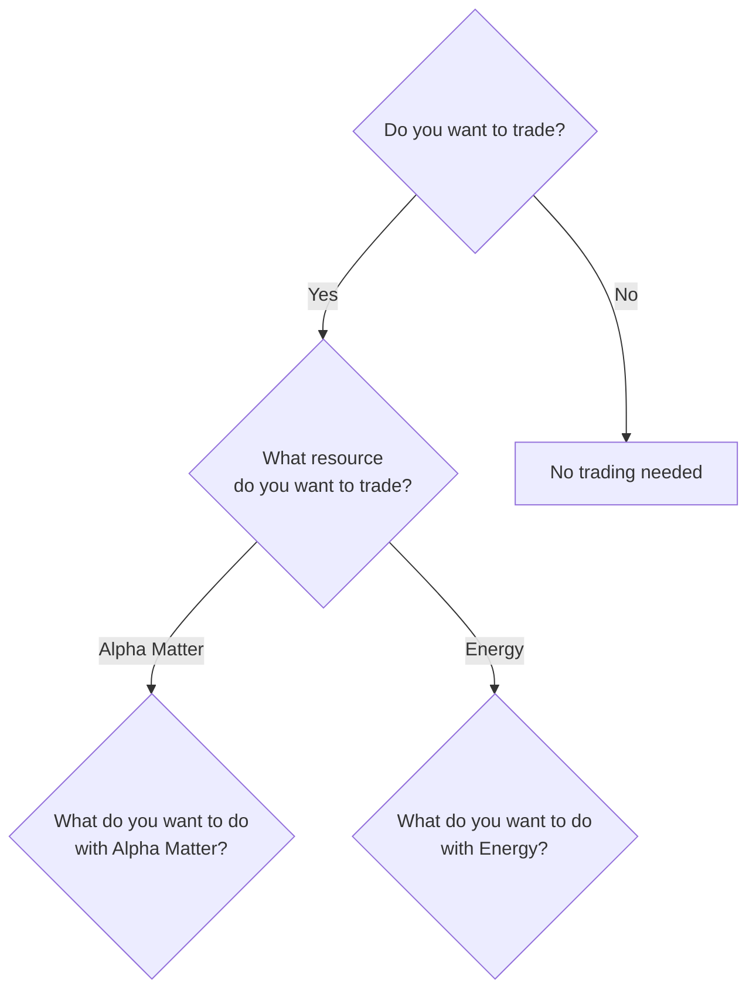
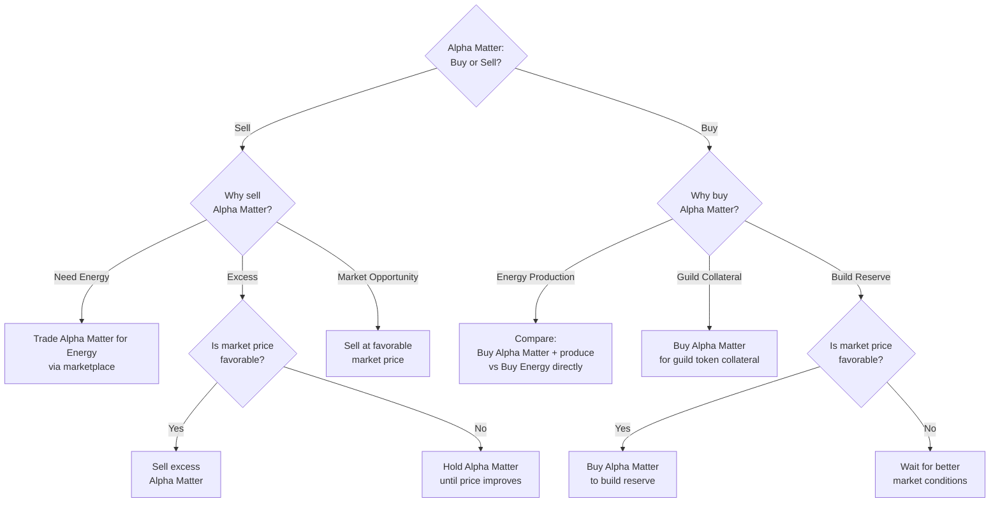
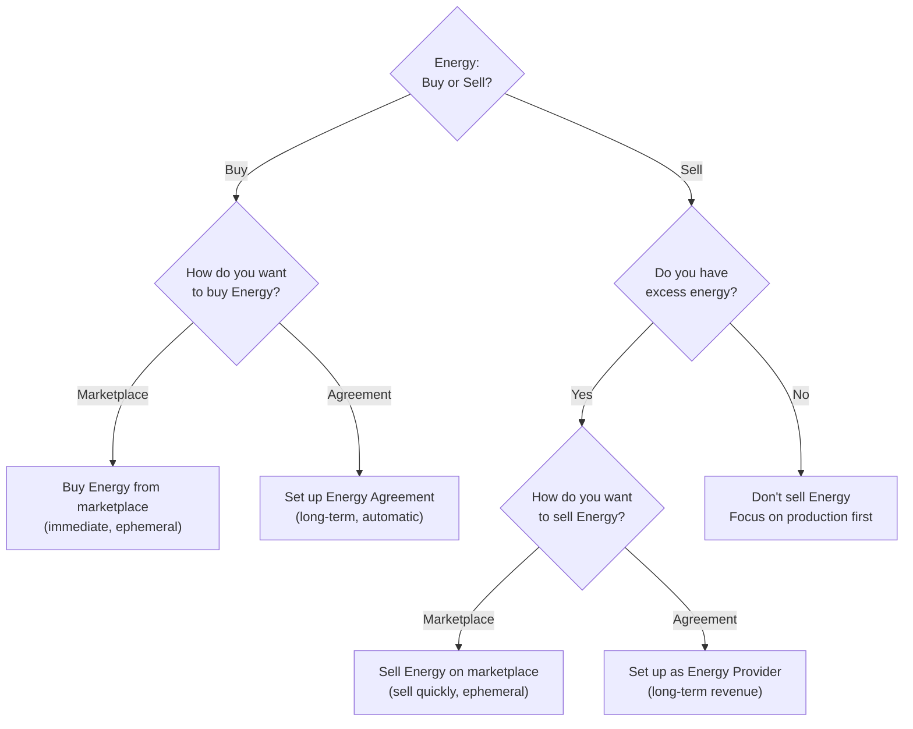

# Trading Decision Tree

**Version**: 1.0.0
**Category**: economic
**Priority**: high
**Description**: Decision tree for trading Alpha Matter and Energy on the marketplace

---

## Decision Flowchart

### Top-Level Decision

### Alpha Matter Trading

### Energy Trading

## Condition Table

| Condition | True Path | False Path | Notes |
|-----------|-----------|------------|-------|
| Want to trade? | Choose resource type | No trading needed | Entry point |
| Resource = Alpha Matter | Alpha Matter buy/sell | Check Energy | Resource selection |
| Resource = Energy | Energy buy/sell | -- | Resource selection |
| Selling excess, price favorable? | Sell Alpha Matter | Hold until price improves | Market timing |
| Building reserve, price favorable? | Buy Alpha Matter | Wait for better conditions | Market timing |
| Have excess energy? | Choose sell method | Don't sell, focus on production | Prerequisite for selling |

## Alpha Matter Trading

Alpha Matter is the primary tradeable resource. It is secure (cannot be stolen) and can be stored indefinitely.

**Selling Alpha Matter** is driven by three motivations:

- **Need Energy** -- Convert Alpha Matter to Energy through the marketplace using `MsgTradeAlphaMatter` or buy Energy directly. Query the energy market and compare prices before executing.
- **Excess Supply** -- If the market price is favorable, sell surplus Alpha Matter via `MsgTradeAlphaMatter` or `MsgPlaceMarketOrder`. If the price is unfavorable, hold and monitor for improvement.
- **Market Opportunity** -- When market conditions are favorable, sell at the current price to capitalize on the opportunity.

**Buying Alpha Matter** serves three purposes:

- **Energy Production** -- Compare the total cost of buying Alpha Matter and producing energy versus buying Energy directly. Query both markets and choose the cheaper option.
- **Guild Token Collateral** -- Alpha Matter is required as collateral for minting guild tokens. Execute a buy trade when guild operations demand it.
- **Building Reserves** -- Buy when the market price is favorable; wait when it is not.

## Energy Trading

Energy is ephemeral and must be consumed immediately. This fundamentally shapes all energy trading decisions.

**Buying Energy** offers two methods:

- **Marketplace (Immediate)** -- Buy via `MsgTradeEnergy` for immediate use. Have consumption planned before purchasing since energy cannot be stored.
- **Automated Agreement (Long-term)** -- Set up an Energy Agreement via `MsgAgreementOpen` for consistent, automatic supply with penalty protection.

**Selling Energy** requires excess production capacity:

- **Marketplace (Immediate)** -- Sell via `MsgTradeEnergy`. Execute quickly since energy is ephemeral.
- **Automated Agreement (Long-term)** -- Create a provider with `MsgProviderCreate` and set up agreements for consistent revenue.

## Trading Strategies

| Strategy | Description | When to Apply |
|----------|-------------|---------------|
| Buy Low, Sell High | Monitor prices, identify trends, time purchases and sales | Ongoing market participation |
| Expansion Phase | High demand, rising prices | Sell resources |
| Consolidation Phase | Balanced market, stable prices | Trade normally |
| Conflict Phase | Price volatility | Buy if supply available |
| Recovery Phase | Market normalization | Buy at low prices |

## Best Practices

- **Monitor market prices** -- Prices fluctuate based on supply and demand. Track over time to identify trends.
- **Time your trades** -- Buy during low-demand periods and sell during high-demand periods for maximum profitability.
- **Energy is ephemeral** -- Always have consumption ready before buying energy. This is the most critical constraint in energy trading.
- **Alpha Matter is secure** -- Alpha Matter cannot be stolen, so it can be traded without security concerns.

## Related Documentation

- [Resource Allocation Decision Tree](decision-tree-resource-allocation.md) -- How to allocate resources across operations
- [Reactor vs Generator Decision Tree](decision-tree-reactor-vs-generator.md) -- Energy production options
- [API Quick Reference](../reference/api-quick-reference.md) -- Trade endpoints
- [Resource Security Decision Tree](decision-tree-resource-security.md) -- Securing resources before trading
