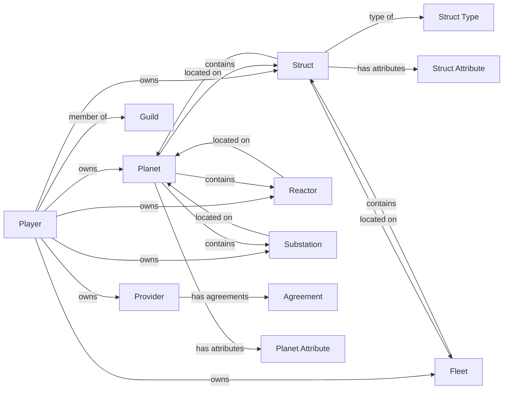

# Entity Relationship Graph

**Version**: 1.0.0
**Category**: system
**Type**: relationship

Complete entity relationship graph showing all entity types and their connections.

---

## Entity Relationship Diagram

## Entities

| ID | Label | Entity Type | Category | Endpoint |
|----|-------|-------------|----------|----------|
| player | Player | Player | core | `/structs/player/{id}` |
| planet | Planet | Planet | core | `/structs/planet/{id}` |
| struct | Struct | Struct | core | `/structs/struct/{id}` |
| struct-type | Struct Type | StructType | core | `/structs/struct_type/{id}` |
| fleet | Fleet | Fleet | core | `/structs/fleet/{id}` |
| guild | Guild | Guild | social | `/structs/guild/{id}` |
| reactor | Reactor | Reactor | resource | `/structs/reactor/{id}` |
| substation | Substation | Substation | resource | `/structs/substation/{id}` |
| provider | Provider | Provider | economic | `/structs/provider/{id}` |
| agreement | Agreement | Agreement | economic | `/structs/agreement/{id}` |
| planet-attribute | Planet Attribute | PlanetAttribute | core | `/structs/planet_attribute/{planetId}/{attributeType}` |
| struct-attribute | Struct Attribute | StructAttribute | core | `/structs/struct_attribute/{structId}/{attributeType}` |

## Relationships

| ID | From | To | Type | Cardinality | Notes |
|----|------|----|------|-------------|-------|
| r1 | Player | Planet | owns | one-to-one | Players can only own one planet at a time |
| r2 | Player | Struct | owns | one-to-many | |
| r3 | Player | Fleet | owns | one-to-many | |
| r4 | Player | Reactor | owns | one-to-many | |
| r5 | Player | Substation | owns | one-to-many | |
| r6 | Player | Provider | owns | one-to-many | |
| r7 | Player | Guild | memberOf | many-to-one | |
| r8 | Planet | Struct | contains | one-to-many | |
| r9 | Planet | Reactor | contains | one-to-many | |
| r10 | Planet | Substation | contains | one-to-many | |
| r11 | Planet | Planet Attribute | hasAttributes | one-to-many | |
| r12 | Struct | Struct Type | typeOf | many-to-one | |
| r13 | Struct | Planet | locatedOn | many-to-one | |
| r14 | Struct | Fleet | locatedOn | many-to-one | |
| r15 | Struct | Struct Attribute | hasAttributes | one-to-many | |
| r16 | Fleet | Struct | contains | one-to-many | |
| r17 | Provider | Agreement | hasAgreements | one-to-many | |
| r18 | Reactor | Planet | locatedOn | many-to-one | |
| r19 | Substation | Planet | locatedOn | many-to-one | |

## Related Documentation

- [Entity Schemas](../../schemas/entities.md)
- [Resource Flow](resource-flow.md)
