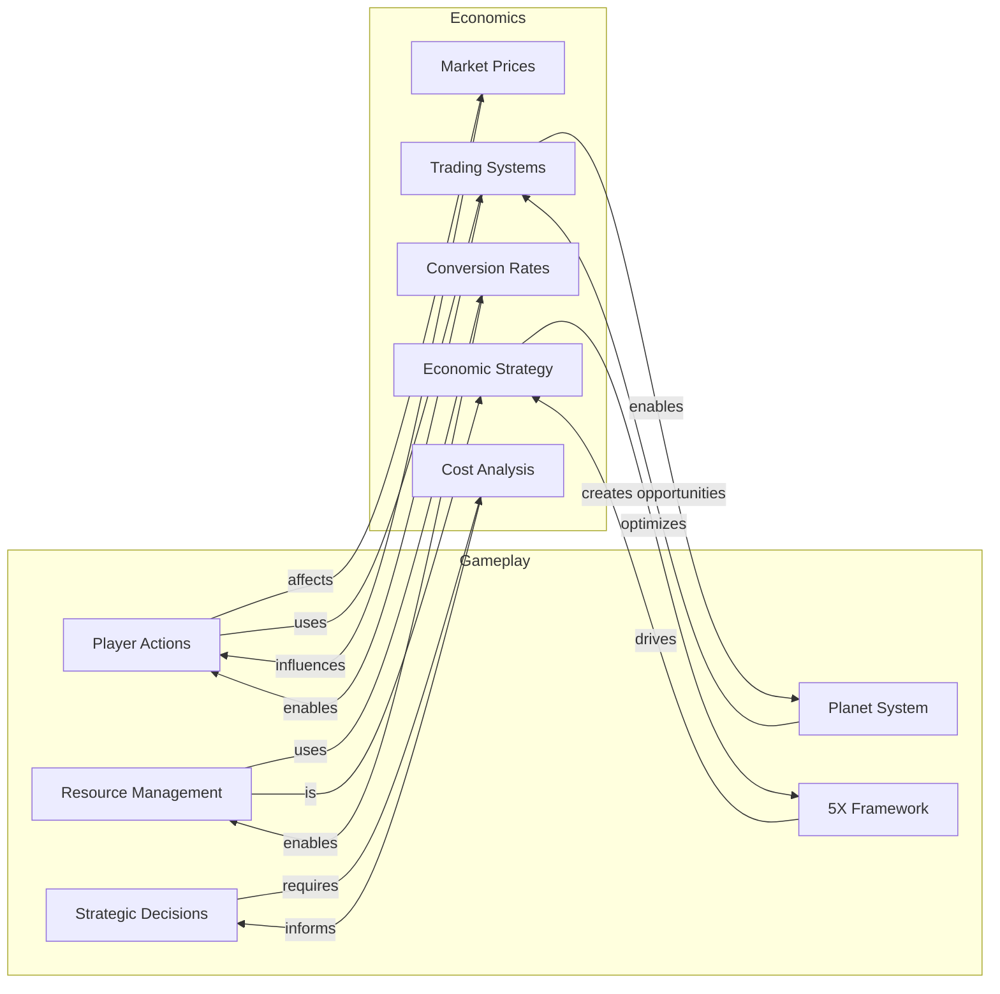

# Gameplay / Economics Relationships

**Version**: 1.0.0
**Category**: system
**Type**: relationship

Complete relationship graph showing how gameplay mechanics connect to economic systems.

---

## Gameplay-Economics Integration Diagram

## Entities

### Gameplay Mechanics

| ID | Label | Examples / Features |
|----|-------|---------------------|
| player-actions | Player Actions | explore, mine, build, attack, expand |
| resource-management | Resource Management | Alpha Matter, Watts, Ore |
| strategic-decisions | Strategic Decisions | what to build, when to expand, when to trade |
| 5x-framework | 5X Framework | Explore, Extract, Expand, Exterminate, Exchange |
| planet-system | Planet System | territory, slots, ore deposits |

### Economic Systems

| ID | Label | Key Aspects |
|----|-------|-------------|
| market-prices | Market Prices | supply, demand |
| conversion-rates | Conversion Rates | reactor, fieldGenerator, continentalPowerPlant, worldEngine |
| cost-analysis | Cost Analysis | build vs buy, opportunity cost, resource optimization |
| trading-systems | Trading Systems | buy, sell, market orders |
| economic-strategy | Economic Strategy | optimization, economic warfare, resource allocation |

## Relationships

| ID | From | To | Type | Cardinality | Description |
|----|------|----|------|-------------|-------------|
| r1 | Player Actions | Market Prices | affects | many-to-many | Mining and trading affect supply/demand and prices |
| r2 | Market Prices | Player Actions | influences | many-to-many | Prices influence player decisions about what actions to take |
| r3 | Resource Management | Conversion Rates | uses | many-to-many | Resource management uses conversion rates to optimize Alpha Matter to Watts conversion |
| r4 | Conversion Rates | Resource Management | enables | many-to-many | Conversion rates enable resource management strategies (safe vs efficient) |
| r5 | Strategic Decisions | Cost Analysis | requires | many-to-many | Strategic decisions require cost analysis to evaluate options |
| r6 | Cost Analysis | Strategic Decisions | informs | many-to-many | Cost analysis informs strategic decisions (build vs buy, when to expand) |
| r7 | 5X Framework | Economic Strategy | drives | one-to-many | 5X Framework drives economic strategy decisions |
| r8 | Economic Strategy | 5X Framework | optimizes | many-to-one | Economic strategy optimizes 5X Framework execution |
| r9 | Planet System | Trading Systems | creates | one-to-many | Planet system creates economic opportunities (better planets = better income) |
| r10 | Trading Systems | Planet System | enables | many-to-one | Trading systems enable planet expansion and resource acquisition |
| r11 | Resource Management | Economic Strategy | is | one-to-one | Resource management is economics in action |
| r12 | Player Actions | Trading Systems | uses | many-to-many | Player actions use trading systems to buy/sell resources |
| r13 | Trading Systems | Player Actions | enables | many-to-many | Trading systems enable player actions by providing resource access |

## Related Documentation

- [Resource Flow](resource-flow.md)
- [Entity Relationships](entity-relationships.md)
- [Gameplay Schema](../../schemas/gameplay.md)
- [Economics Schema](../../schemas/economics.md)
- [Markets Schema](../../schemas/markets.md)
- [Trading Schema](../../schemas/trading.md)
- [Actions Schema](../../schemas/actions.md)
