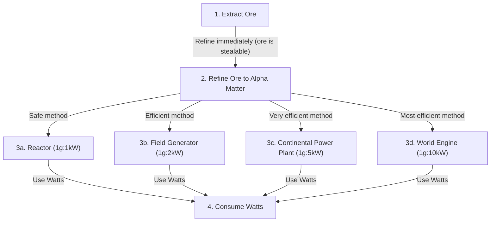

# Resource Conversion Flow

**Version**: 1.0.0
**Category**: gameplay
**Type**: flow

Complete resource flow from extraction to consumption, showing security levels and conversion methods.

---

## Resource Flow Diagram

## Flow Steps

### Step 1: Extract Ore

| Property | Value |
|----------|-------|
| Action | mine |
| Input | Alpha Ore (from planet) |
| Output | Stored Ore (on planet) |
| Security | Stealable - refine immediately |
| Risk | High |
| Requirements | Ore Extractor struct, planet with ore deposits, sufficient power (500k Watts) |

### Step 2: Refine Ore to Alpha Matter

| Property | Value |
|----------|-------|
| Action | refine |
| Input | Stored Ore (on planet) |
| Output | Alpha Matter (in bank account) |
| Security | Secure |
| Risk | None |
| Conversion Rate | 1:1 |
| Requirements | Ore Refinery struct, stored ore available, sufficient power (500k Watts) |
| Best Practice | Maintain 20-30% Alpha Matter reserve |

### Step 3: Convert Alpha Matter to Watts

Four conversion methods with increasing efficiency and risk:

| Method | Struct | Rate | Risk | Description |
|--------|--------|------|------|-------------|
| Reactor | Reactor | 1g : 1kW | Low | Safe, reliable conversion |
| Field Generator | Field Generator | 1g : 2kW | High | Efficient but risky |
| Continental Power Plant | Continental Power Plant | 1g : 5kW | High | Very efficient but higher risk |
| World Engine | World Engine | 1g : 10kW | High | Most efficient but highest risk |

All conversion methods require Alpha Matter available and recommend maintaining a 20-30% reserve.

### Step 4: Consume Watts

| Property | Value |
|----------|-------|
| Input | Watts (from player power system) |
| Security | Secure |
| Consumption | Continuous |

Example power costs:

| Structure | Power Cost |
|-----------|-----------|
| Command Ship | 50,000 W |
| Starfighter | 100,000 W |
| Planetary Battleship | 135,000 W |
| Economic Structs | 500,000 W |

## Transitions

| ID | From | To | Condition | Priority / Risk |
|----|------|----|-----------|-----------------|
| t1 | Extract Ore | Refine | Ore available | High priority - ore is stealable |
| t2 | Refine | Reactor | Alpha Matter available, choose safe method | Low risk |
| t3 | Refine | Field Generator | Alpha Matter available, choose efficient method | High risk |
| t4 | Refine | Continental Power Plant | Alpha Matter available, choose very efficient method | High risk |
| t5 | Refine | World Engine | Alpha Matter available, choose most efficient method | High risk |
| t6 | Reactor | Consume Watts | Watts available | |
| t7 | Field Generator | Consume Watts | Watts available | |
| t8 | Continental Power Plant | Consume Watts | Watts available | |
| t9 | World Engine | Consume Watts | Watts available | |

## Related Documentation

- [Entity Relationships](entity-relationships.md)
- [Actions Schema](../../schemas/actions.md)
- [Gameplay Schema](../../schemas/gameplay.md)
