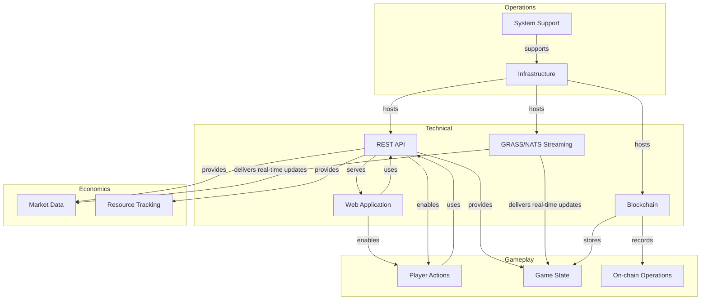

# System Integration Graph

**Version**: 1.0.0
**Category**: system
**Type**: relationship

Complete system integration showing how technical systems, gameplay, economics, and operations connect.

---

## System Integration Diagram

## Entities

### Technical Systems

| ID | Label | Type | Purpose |
|----|-------|------|---------|
| api | REST API | REST | Query game state, submit actions |
| grass-stream | GRASS/NATS Streaming | Event Streaming | Real-time game state updates |
| blockchain | Blockchain (Consensus Network) | Blockchain | Permanent record, on-chain state |
| webapp | Web Application | Web Application | Player interface, aggregated data |

### Gameplay Systems

| ID | Label | Components / Examples |
|----|-------|----------------------|
| player-actions | Player Actions | build, mine, attack, explore |
| game-state | Game State | planets, resources, structs, players |
| on-chain-operations | On-chain Operations | battles, ownership, transactions |

### Economic Systems

| ID | Label | Components |
|----|-------|------------|
| market-data | Market Data | prices, supply, demand, trades |
| resource-tracking | Resource Tracking | Alpha Matter, Watts, Ore |

### Operations Systems

| ID | Label | Components |
|----|-------|------------|
| infrastructure | Infrastructure | nodes, services, database |
| system-support | System Support | monitoring, deployment, scaling |

## Relationships

| ID | From | To | Type | Description |
|----|------|----|------|-------------|
| r1 | REST API | Player Actions | enables | API provides endpoints to query state and submit actions |
| r2 | Player Actions | REST API | uses | Player actions use API to query state and submit transactions |
| r3 | REST API | Game State | provides | API provides game state data through query endpoints |
| r4 | Game State | REST API | accessedVia | Game state is accessed via API endpoints |
| r5 | GRASS/NATS | Game State | delivers | Streaming delivers real-time game state updates |
| r6 | Game State | GRASS/NATS | streamedVia | Game state changes are streamed via GRASS/NATS |
| r7 | Blockchain | On-chain Ops | records | Blockchain records all on-chain operations |
| r8 | On-chain Ops | Blockchain | storedOn | On-chain operations are permanently stored on blockchain |
| r9 | Blockchain | Game State | stores | Blockchain stores permanent, verifiable game state |
| r10 | Game State | Blockchain | storedOn | Game state is stored on blockchain for permanence |
| r11 | REST API | Market Data | provides | API provides market data (prices, supply, demand) |
| r12 | Market Data | REST API | accessedVia | Market data is accessed via API endpoints |
| r13 | GRASS/NATS | Market Data | delivers | Streaming delivers real-time market updates |
| r14 | Market Data | GRASS/NATS | streamedVia | Market data changes are streamed via GRASS/NATS |
| r15 | REST API | Resource Tracking | provides | API provides resource tracking data |
| r16 | Resource Tracking | REST API | accessedVia | Resource tracking data is accessed via API |
| r17 | Infrastructure | REST API | hosts | Infrastructure hosts API services |
| r18 | REST API | Infrastructure | runsOn | API runs on infrastructure |
| r19 | Infrastructure | GRASS/NATS | hosts | Infrastructure hosts streaming services |
| r20 | GRASS/NATS | Infrastructure | runsOn | Streaming runs on infrastructure |
| r21 | Infrastructure | Blockchain | hosts | Infrastructure hosts blockchain nodes |
| r22 | Blockchain | Infrastructure | runsOn | Blockchain runs on infrastructure nodes |
| r23 | System Support | Infrastructure | supports | Monitoring and deployment supports infrastructure |
| r24 | Infrastructure | System Support | monitoredBy | Infrastructure is monitored by system support |
| r25 | Web Application | REST API | uses | Web application uses API for data access |
| r26 | REST API | Web Application | serves | API serves web application with game data |
| r27 | Web Application | Player Actions | enables | Web application enables player actions through UI |
| r28 | Player Actions | Web Application | performedVia | Player actions can be performed via web application |

## Related Documentation

- [Gameplay Economics](gameplay-economics.md)
- [Resource Flow](resource-flow.md)
- [Entity Relationships](entity-relationships.md)
- [Game State Schema](../../schemas/game-state.md)
- [Entity Schemas](../../schemas/entities.md)
- [Markets Schema](../../schemas/markets.md)
- [API Endpoints](../../api/endpoints.md)
- [Streaming Event Types](../../api/streaming/event-types.md)
