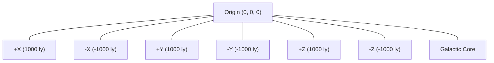

# Galactic Coordinate System

**Version**: 1.0.0
**Category**: spatial
**Type**: coordinate-system

Coordinate system definition for galactic space in Structs.

---

## Coordinate System Overview

## System Properties

| Property | Value |
|----------|-------|
| Type | Cartesian (3D) |
| Origin | (0, 0, 0) |
| Units | Light-years |
| Bounds (min) | (-1000, -1000, -1000) |
| Bounds (max) | (1000, 1000, 1000) |
| Total Volume | 2000 x 2000 x 2000 light-years |

## Regions

### Galactic Core

| Property | Value |
|----------|-------|
| ID | galactic-core |
| Description | Central region of the galaxy |
| Bounds (min) | (-100, -100, -100) |
| Bounds (max) | (100, 100, 100) |
| Volume | 200 x 200 x 200 light-years |
| Relative Size | 0.1% of total galactic volume |

## Axis Definitions

| Axis | Min | Max | Range |
|------|-----|-----|-------|
| X | -1000 ly | +1000 ly | 2000 ly |
| Y | -1000 ly | +1000 ly | 2000 ly |
| Z | -1000 ly | +1000 ly | 2000 ly |

## Related Documentation

- [Planet Entity Schema](../../schemas/entities/planet.md)
- [Fleet Entity Schema](../../schemas/entities/fleet.md)
